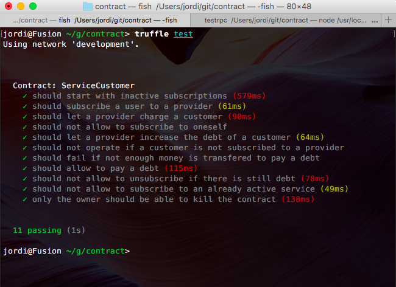

Ethereum Service Bills example
---

This is an example code of an Ethereum Smart Contract

Its goal is to illustrate a contract in which a user subscribes to service providers (electricity, water, gas, isp, etc), lets them set the money to be paid and keeps track of what debts are still pending or not.

The contract features the following operations: 

* `function signUp(address provider) `
* `function charge(address customer, uint256 amount) `
* `function getDebt(address customer, address provider) constant returns (uint256 debt) `
* `function payDebt(address provider) payable`
* `function unsubscribe(address provider)`
* `function kill() ownerOnly`

### Compile and run

Install `truffle` on your computer

```bash
$ npm install -g truffle ethereumjs-testrpc
```

In one terminal window, launch `testrpc`

In the other one, use `truffle` to compile and deploy the app to your local net.

```bash
$ truffle compile
Compiling ./contracts/Migrations.sol...
Compiling ./contracts/ServiceCustomer.sol...
Writing artifacts to ./build/contracts
```

```bash
$ truffle migrate
Using network 'development'.

Running migration: 1_initial_migration.js
  Deploying Migrations...
  Migrations: 0xedd7cc2bb0ad2770f65228163f8853eb83c27af1
Saving successful migration to network...
Saving artifacts...
Running migration: 2_deploy_contracts.js
  Deploying ServiceCustomer...
  ServiceCustomer: 0x0c110d9d3626d2d3cdb888f305d3aedde83772f8
Saving successful migration to network...
Saving artifacts...
```

```bash
$ truffle console
truffle(development)> 
```

And then interact with the contracts as you need.

### Testing

```bash
$ truffle test
```


